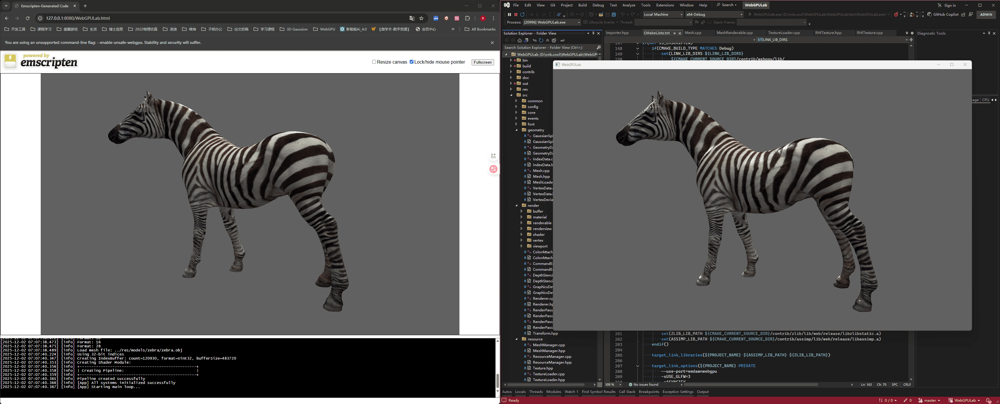
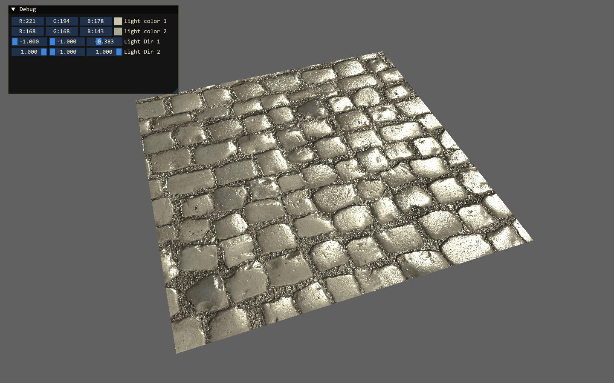
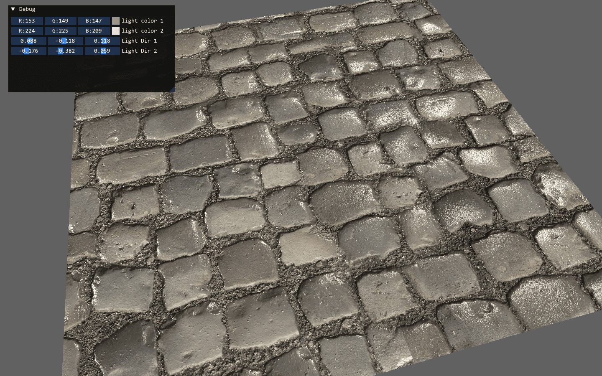
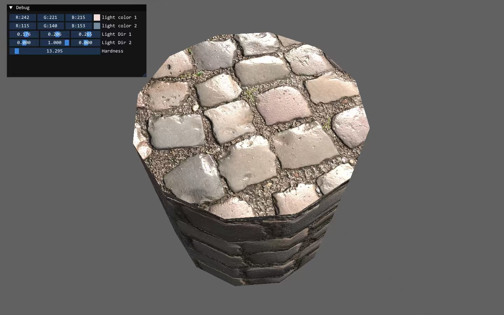
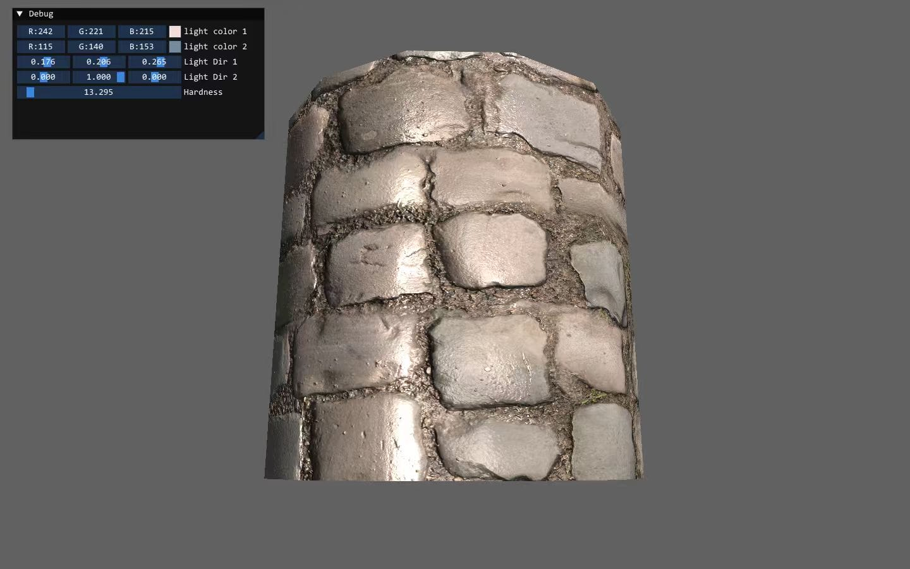
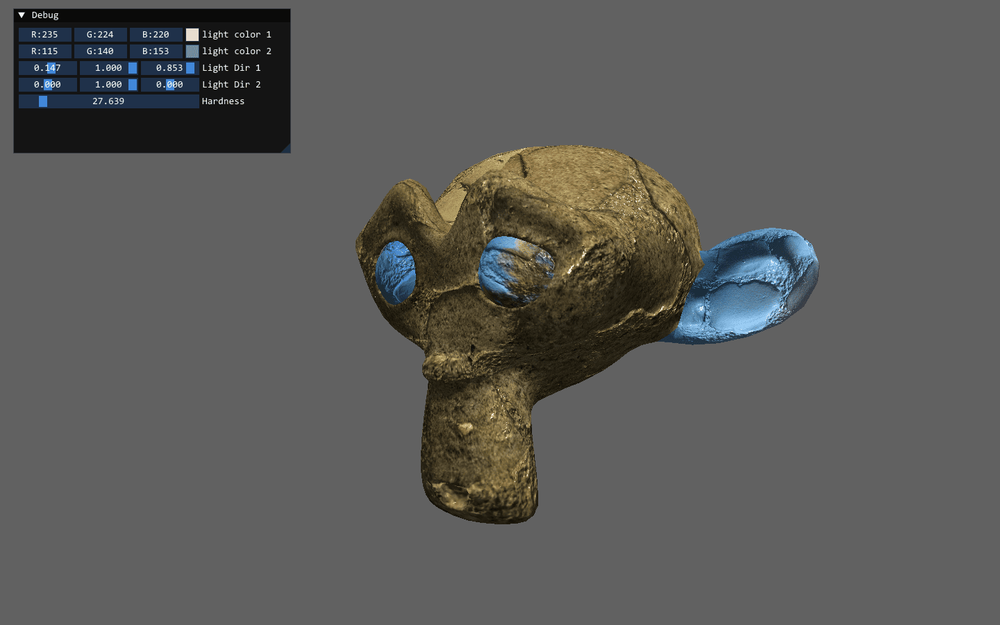
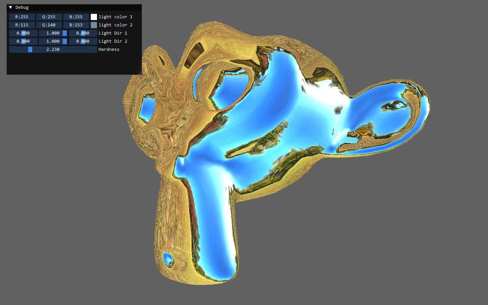

# Introduce

With over a decade of experience in the game industry, I have played a key role in the development and ongoing maintenance of multiple published titles—some of which were still in the prototype stage when I joined the projects.

My expertise lies primarily in game server development, where I’ve designed and implemented a wide range of core systems, including character attributes, quest/task logic, battle mechanics, map management, in-game mall (store), chat functionality, and foundational network and database interfaces. I also have hands-on experience developing client-side modules, such as networking layers, combat logic, collision detection, and physics systems.

Beyond gameplay systems, I built a custom toolchain to support and automate various stages of the game release pipeline, improving efficiency and reliability throughout the deployment process.

<a href="">WebGPU</a>

<table>
    <tr>
        <td></td>
    </tr>
</table>
<table>
    <tr>
        <td></td>
        <td></td>
    </tr>
    <tr>
        <td></td>
        <td></td>
    </tr>
        <td></td>
        <td></td>
    </tr>
</table>

# Graphics Homeworks

<a href="./homeworks/games101/index.html">GAMES101:  计算机图形学</a>

<table>
    <tr>
        <td></td>
        <td></td>
        <td></td>
        <td></td>
    </tr>
</table>

<a href="./homeworks/games202/index.html">GAMES202:  高质量实时渲染</a>

<table>
    <tr>
        <td></td>
        <td></td>
        <td></td>
        <td></td>
    </tr>
</table>

<a href="./homeworks/games102/index.html">GAMES102:  几何建模与处理基础</a>

<table>
    <tr>
        <td></td>
        <td></td>
        <td></td>
        <td></td>
    </tr>
</table>

<a href="./homeworks/games103/index.html">GAMES103:  基于物理的计算机动画入门</a>

<a href="https://www.bilibili.com/video/BV1t34y157RT?spm_id_from=333.999.0.0&vd_source=2b73758ae03cf222969eb28d139ccc94">Physics Simulation Video</a>

<table>
    <tr>
        <td></td>
        <td></td>
        <td></td>
        <td></td>
    </tr>
</table>
