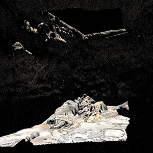

# Introduce

I am having been work in game industry for dozen years, and involved in the development and maintain of several published games. Some of these games were in prototype stage when I joined. 

I mainly developed game server parts, and also coded client modules sometimes(such as networks, fight, collision, physicis moduels, etcs.). 

I am familiar with the business process of the game server, and have developed a variety of core modules, such as attributes, tasks, battles, maps, mall, chat, and base interfaces of the network and database, etcs. I also developed toolchain for games release process.

# Graphics Homeworks

<a href="./homeworks/games101/index.html">GAMES101:  计算机图形学</front></a>

<table>
    <tr>
        <td></td>
        <td></td>
        <td></td>
        <td></td>
    </tr>
</table>

<a href="./homeworks/games202/index.html">GAMES202:  高质量实时渲染</front></a>

<table>
    <tr>
        <td></td>
        <td></td>
        <td></td>
        <td></td>
    </tr>
</table>

<a href="./homeworks/games102/index.html">GAMES102:  几何建模与处理基础</front></a>

<table>
    <tr>
        <td></td>
        <td></td>
        <td></td>
        <td></td>
    </tr>
</table>

<a href="./homeworks/games103/index.html">GAMES103:  基于物理的计算机动画入门</front></a>

<table>
    <tr>
        <td></td>
        <td></td>
        <td></td>
        <td></td>
    </tr>
</table>
