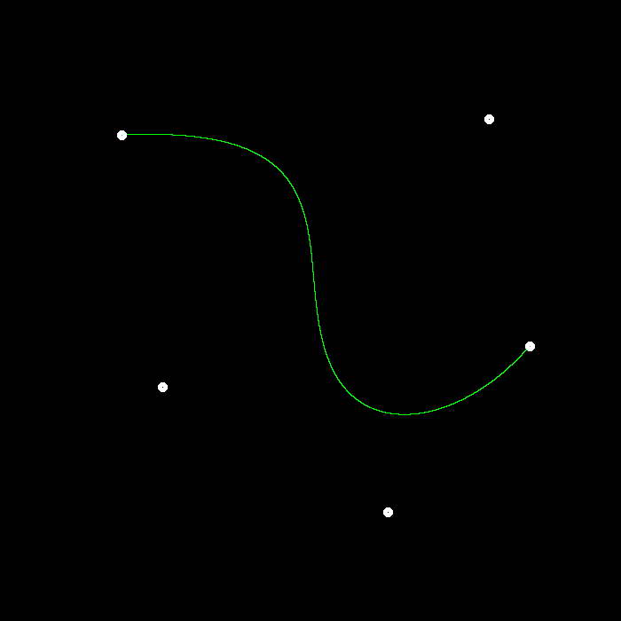
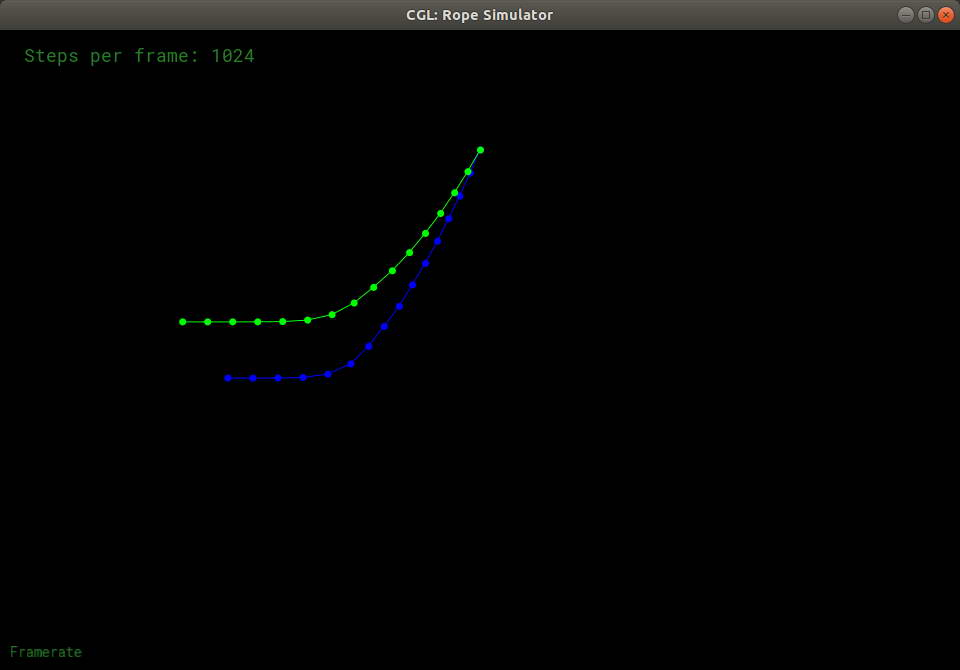

# 计算机图形学

<table>
    <tr>
        <td align='center'></td>
    </tr>
</table>

# GAMES101 Lab1

<table border="0">
    <tr>
        <td align='center'></td>
    </tr>
</table>

## 完成提高题

```cpp
Eigen::Matrix4f get_rotation(Vector3f axis, float angle)
{
    Eigen::Matrix4f model = Eigen::Matrix4f::Identity();
    const float angle2radian = MY_PI / 180.f;
    float radian = angle * angle2radian;

    float c = std::cos(radian);
    float nc = 1 - c;
    float s = std::sin(radian);

    float x = axis.x();
    float y = axis.y();
    float z = axis.z();

    model << c + x*x*nc,   x*y*nc - z*s, y*s + x*z*nc,  0,
             z*s + x*y*nc, c + y*y*nc,   -x*s + y*z*nc, 0,
             -y*s+x*z*nc,  x*s+y*z*nc,   c+z*z*nc,      0,
             0,            0,            0,             1;

    return model;
}
```

# GAMES101 Lab2

<table border="0">
    <tr>
        <td align='center'></td>
    </tr>
</table>

## 完成提高部分

```
判断点是否在三角形内
insideTriangle

计算三角形的最小包围，为了加速计算
cal_mini_bounding

设置 msaa 坐标下的像素颜色和深度
set_msaa_pixel

获得 msaa 下，对应像素的颜色加权值
get_msaa_pixel

查找 msaa 颜色缓存的下标值
get_mass_color_idx
```

<table border="0">
    <tr>
        <td align='center'>无抗锯齿</td>
        <td align='center'>有抗锯齿</td>
    </tr>
    <tr>
        <td align='center'></td>
        <td align='center'></td>
    </tr>
</table>

# GAMES101 Lab3

<table border="0">
    <tr>
        <td align='center'></td>
    </tr>
</table>

## 完成了普通练习和两个提高部分

### 生成的图片开启了 MSAA

### 提高一

- 使用了 rock 和 bunny 模型，eye_pos 调整 (0, 0, 25)
- head_tri.obj 模型，angle为20, eye_pos 调整 (0, 0, 2)

### 提高二

- 使用了自己缩放的 256x256 图片作为演示

## 练习

<table border="0">
    <tr>
        <td align='center'>normal shader</td>
    </tr>
    <tr>
        <td align='center'></td>
    </tr>
    <tr>
        <td align='center'>phong shader</td>
    </tr>
    <tr>
        <td align='center'></td>
    </tr>
    <tr>
        <td align='center'>texture shader</td>
    </tr>
    <tr>
        <td align='center'></td>
    </tr>
    <tr>
        <td align='center'>bump shader</td>
    </tr>
    <tr>
        <td align='center'></td>
    </tr>
    <tr>
        <td align='center'>displacement shader</td>
    </tr>
    <tr>
        <td align='center'></td>
    </tr>
</table>

## 提高

### 加载其他模型

<table border="0">
    <tr>
        <td align='center'>/models/rock/rock.obj</td>
    </tr>
    <tr>
        <td align='center'></td>
    </tr>
    <tr>
        <td align='center'>/models/bunny.obj</td>
    </tr>
    <tr>
        <td align='center'></td>
    </tr>
    <tr>
        <td align='center'>/models/lpshead/head_tri.obj</br>使用的 custom_fragment_shader</td>
    </tr>
    <tr>
        <td align='center'></td>
    </tr>
</table>

## bilinear 效果

<table border="0">
    <tr>
        <td align='center'>256x256 原图效果</td>
    </tr>
    <tr>
        <td align='center'></td>
    </tr>
    <tr>
        <td align='center'>256x256 bilinear</td>
    </tr>
    <tr>
        <td align='center'></td>
    </tr>
    <tr>
        <td align='center'>原图 bilinear</td>
    </tr>
    <tr>
        <td align='center'></td>
    </tr>
    <tr>
        <td align='center'>bilinear 使用的缩放图</td>
    </tr>
    <tr>
        <td align='center'></td>
    </tr>
</table>

# GAMES101 Lab4

<table border="0">
    <tr>
        <td align='center'></td>
    </tr>
</table>

## 完成内容

- 完成 De Casteljau 算法
- 完成提高 反走样

### 其他

- 鼠标左键控制点拖动
- 鼠标右键控制点删除
- 按键 a 开启/关闭 反走样
- 按键 e 绘制/不绘制 控制线
- 按键 c 清除画板
- 按键 s 保存  my_bezier_curve.jpg 图片

## 函数说明

### DrawCanvas 类

含有 window 类引用
标记数据脏，标记反走样、标记绘制边
保存控制点、绘制定点，反走样点

### 鼠标相关

- onMouseLeftButton 实现鼠标左键选取
- onMouseRightButton 鼠标右键删除
- onMouseMove 鼠标移动

### 控制点相关

- findControlPointByRadius 按点击范围找控制点
- delControlPointByRadius 删除控制点
- drawControlPoints 绘制控制点（激活红色，不激活白色）

### 绘制

- draw 绘制曲线

### 反走样

- calcAntiAlising 计算反走样涉及的点
- calcAntiPoint 计算反走样点颜色融合

### 其他

实现了 bezier 和 recursive_bezier 函数

## 样例

<table border="0">
    <tr>
        <td align='center'>01 与样例重合的图像</td>
    </tr>
    <tr>
        <td align='center'></td>
    </tr>
    <tr>
        <td align='center'>02 无反走样</td>
    </tr>
    <tr>
        <td align='center'></td>
    </tr>
    <tr>
        <td align='center'>03 开启反走样</td>
    </tr>
    <tr>
        <td align='center'></td>
    </tr>
    <tr>
        <td align='center'>04 选取控制点、有连线</td>
    </tr>
    <tr>
        <td align='center'></td>
    </tr>
</table>

# GAMES101 Lab5

<table border="0">
    <tr>
        <td align='center'></td>
    </tr>
</table>

## 完成内容

- 完成光线生成
- 完成 Moller-Trumbore  算法

## 样例

<table border="0">
    <tr>
        <td align='center'>01 每像素使用1条射线</td>
    </tr>
    <tr>
        <td align='center'></td>
    </tr>
    <tr>
        <td align='center'>02 每像素使用4条射线采样</td>
    </tr>
    <tr>
        <td align='center'></td>
    </tr>
</table>

# GAMES101 Lab6

<table border="0">
    <tr>
        <td align='center'></td>
    </tr>
</table>

## 完成内容

- 完成 包围盒求交
- 完成 BVH 查找
- 完成 SAH 加速

## 其他优化

- BVH Middle 快速选择
- 判断包围盒时，检查是否距离大于已获得的距离
- 优化碰撞返回信息为指针
- NAIVE 和 SAH 使用不同的多线程执行方式，是因为各取了最优执行速度的方法

```c++
global.hpp 添加新的定义

// 是否使用多线程 0:不使用, 1:使用
#define MUTIL_THREAD 1

// BVH 使用 SAH
#define BVH_SPLIT_TYPE BVHAccel::SplitMethod::SAH
// BVH 使用 NAIVE
//#define BVH_SPLIT_TYPE BVHAccel::SplitMethod::NAIVE

// 定义三个坐标轴枚举
enum AXIS_DIR
{
    X_AXIS  = 0,
    Y_AXIS  = 1,
    Z_AXIS  = 2,
};
```

## 样例

<table border="0">
    <tr>
        <td align='center'>01 BVH Middle 方法生成图</td>
    </tr>
    <tr>
        <td align='center'></td>
    </tr>
    <tr>
        <td align='center'>单线程</td>
    </tr>
    <tr>
        <td align='center'></td>
    </tr>
    <tr>
        <td align='center'>02 BVH SAH 方法生成图</td>
    </tr>
    <tr>
        <td align='center'></td>
    </tr>
    <tr>
        <td align='center'>多线程</td>
    </tr>
    <tr>
        <td align='center'></td>
    </tr>
</table>

# GAMES101 Lab7

<table border="0">
    <tr>
        <td align='center'></td>
    </tr>
</table>

## 完成内容

- 完成 Path Tracing  算法
- 完成 多线程
- 完成 Microfacet  材质

## 其他优化

- 只实例化一个 get_random_float 中的随机函数对象，大幅提升渲染时间
- SPP 采样时，随机像素点范围内随机采样，消除锯齿
- 预计算 emit 物体的总面积，采样时只遍历 emit 物体列表

```c++
global.hpp 添加新的定义

// 是否使用多线程 0:不使用, 1:使用
#define MUTIL_THREAD 1
// 线程数量
#define THREAD_COUNT 5
// 采样数
#define SPP 16
const float INV_SPP = 1.f / (float)(SPP);
```

```c++
Material.hpp

扩充微表面使用的材料类
enum MaterialType { DIFFUSE, GLOSSY };

添加微表面用到的函数
    inline float fresnelSchlick(const Vector3f& wi, const Vector3f &N);
    inline float geometryShadowing(const Vector3f& l, const Vector3f &v,
                                   const Vector3f& n, const Vector3f &h);
    inline float distributionGGX(const Vector3f& n, const Vector3f &h, float a);
```

## 采样方法补充

1. 多线程使用像素点内随机采样
2. 单线程使用方形阵列采样

## 样例 Path Tracing

<table border="0">
    <tr>
        <td align='center'>CornellBox 有锯齿 SPP2048</td>
    </tr>
    <tr>
        <td align='center'></td>
    </tr>
    <tr>
        <td align='center'>CornellBox 无锯齿 SPP2048</td>
    </tr>
    <tr>
        <td align='center'></td>
    </tr>
    <tr>
        <td align='center'>bunny SPP2048</td>
    </tr>
    <tr>
        <td align='center'></td>
    </tr>
    <tr>
        <td align='center'>微表面 SPP2048</td>
    </tr>
    <tr>
        <td align='center'></td>
    </tr>
    <tr>
        <td align='center'></td>
    </tr>
    <tr>
        <td align='center'>单线程时间</td>
    </tr>
    <tr>
        <td align='center'></td>
    </tr>
    <tr>
        <td align='center'>多线程时间</td>
    </tr>
    <tr>
        <td align='center'></td>
    </tr>
</table>

# GAMES101 Lab8

<table border="0">
    <tr>
        <td align='center'></td>
    </tr>
</table>

## 完成内容

- 完成构造绳子
- 完成半隐式欧拉法
- 完成显式欧拉法
- 完成显式 Verlet 
- 完成阻尼

## 样例

### 显式欧拉法

<table border="0">
    <tr>
        <td align='center'>steps_per_frame 4096</td>
    </tr>
    <tr>
        <td align='center'></td>
    </tr>
    <tr>
        <td align='center'></td>
    </tr>
    <tr>
        <td align='center'>steps_per_frame 8192</td>
    </tr>
    <tr>
        <td align='center'></td>
    </tr>
</table>

### 半隐式欧拉法

<table border="0">
    <tr>
        <td align='center'>steps_per_frame 1024</td>
    </tr>
    <tr>
        <td align='center'></td>
    </tr>
</table>

### Verlet

<table border="0">
    <tr>
        <td align='center'>steps_per_frame 1024</td>
    </tr>
    <tr>
        <td align='center'></td>
    </tr>
</table>

### 欧拉法 和 Verlet

<table border="0">
    <tr>
        <td align='center'>steps_per_frame 1024</td>
    </tr>
    <tr>
        <td align='center'></td>
    </tr>
    <tr>
        <td align='center'></td>
    </tr>
    <tr>
        <td align='center'></td>
    </tr>
</table>

# GAMES101 LabFinal

## 选题 渲染复杂表面的闪光

<table border="0">
    <tr>
        <td align='center'></td>
    </tr>
</table>

### 完成情况

- 没完成功能，所以没录视频

### Glint1 实现 随机闪光

<table border="0">
    <tr>
        <td align='center'>未复现闪光</td>
    </tr>
    <tr>
        <td align='center'></td>
    </tr>
</table>

### Glint3 实现 Position-Normal

- 未复现闪光

- 代码有错误（每次执行的图像会随机执行，多线程下有其他问题未查出）
  
  <table border="0">
    <tr>
        <td align='center'></td>
    </tr>
    <tr>
        <td align='center'></td>
    </tr>
    <tr>
        <td align='center'></td>
    </tr>
  </table>