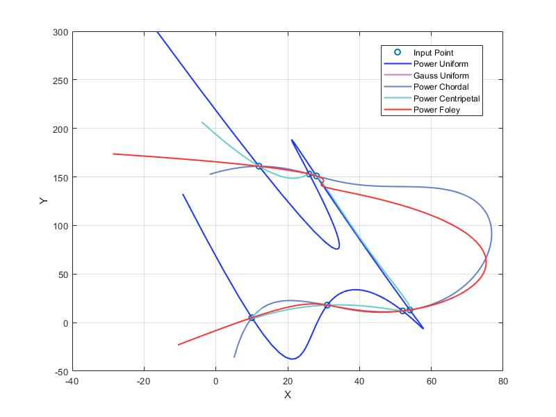
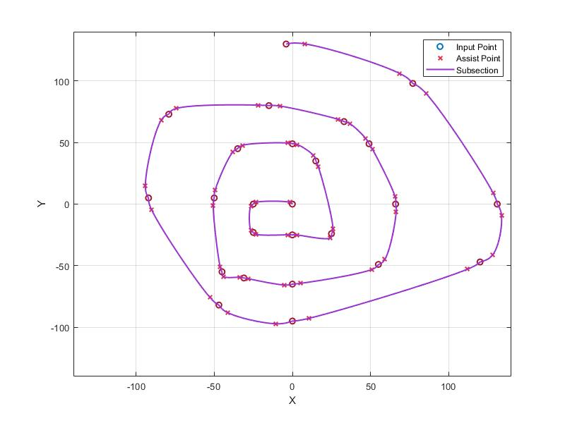
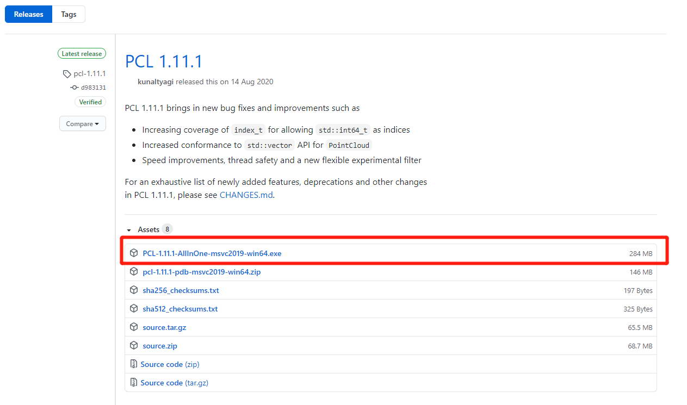

# 几何建模与处理基础

# GAMES102 Lab1

## 一、插值型拟合方法
###  题目1：使用多项式函数（幂基函数的线性组合）$f(x)=\sum_{i=0}^{n-1}\alpha_i B_i(x)$ 插值 $\{P_j\}$，其中 $B_i(x)=x^i$ 
#### 做法：
1. A为方阵， 使用克莱姆法则
    - $|A|\neq0，有唯一解$
    - $x_i=\frac{|A_j|}{|A|}$
2. x 的样本值不相同，行列式不为0，方程有唯一解
###### 步骤:
    1. 计算范德蒙德行列式的值
    2. y替换i列，并计算余子式值
    3. 得到方程组的解

**思考：**

1. 变量比方程多，如何加约束条件？
    - 取与方程数相同的n个变量，对n阶方阵求解
    - 对线段按n个点为一组，求分段函数
    
2. 常数项也可以改为一个低次（比如2次或3次）的多项式，相应也要加约束条件。
	- 最高次数相同
#### 实验
1. 5个采样点
2. 10个采样点

#### 结果
<table>
	<tr>
		<td align='center'>5个样本点</td>
		<td align='center'>10个样本点</td>
	</tr>
	<tr>
		<td></td>
		<td></td>
	</tr>
</table>
---
### 题目2：使用 Gauss 基函数的线性组合 $f(x)=b_0 + \sum_{i=1}^{n}b_i g_i(x)$  插值 $\{P_j\}$，其中 $$g_i(x)=\exp\left(-\frac{(x-x_i)^2}{2\sigma^2}\right)$$

#### 做法：
​	替换题目1中的基函数 $B_i(x)=x^i$  为 $$g_i(x)=\exp\left(-\frac{(x-x_i)^2}{2\sigma^2}\right)$$

#### 实验
1. 生成2组样本
	- 5个坐标点
	- 10个坐标点
2. sigma取两组值
	- sigma 取 1
	- sigma 取 5
#### 结果
<table>
	<tr>
		<td align='center'colspan=2><b>5个样本点</b></td>
	</tr>
	<tr>
		<td align='center'>sigma =1</td>
		<td align='center'>sigma =5</td>
	</tr>
	<tr>
		<td></td>
		<td></td>
	</tr>
</table>
<table>
	<tr>
		<td align='center'colspan=2><b>10个样本点</b></td>
	</tr>
	<tr>
		<td align='center'>sigma =1</td>
		<td align='center'>sigma =5</td>
	</tr>
	<tr>
		<td></td>
		<td></td>
	</tr>
</table>

## 二、逼近型拟合方法

###  题目3：固定幂基函数的最高次数m (m<n)，使用最小二乘法：$\min E$，其中$E(x)=\sum_{i=0}^{n}(y_i-f(x_i))^2$ 拟合 $\{P_j\}$。

#### 做法：

$$
\begin{equation}
\begin{aligned}
\begin{cases} a_{11}x_1+a_{12}x_2+...+a_{1m}x_m=b_1\\ a_{21}x_1+a_{22}x_2+...+a_{2m}x_m=b_2\\ .\\ a_{n1}x_1+a_{n2}x_2+...+a_{nm}x_m=b_n\end{cases},
A = \left( \begin{matrix}a_{11} & a_{12} & ... & a_{1m}\\a_{21} & a_{22} & ... & a_{2m}\\ . & . & ... & .\\ a_{n1} & a_{n2} & ... & a_{nm}\end{matrix}\right), X = (x_1, x_2, ... , x_m)^T, B = (b_1, b_2, ... , b_n)^T
\end{aligned}
\end{equation}
$$

$$
\begin{equation}
\begin{aligned}
R=\frac{1}{2}\sum_{i=1}^n(\sum_{j=1}^ma_{ij}x_j-b_i)^2
\end{aligned}
\end{equation}
$$

$$
\begin{equation}
\begin{aligned}
\frac{\partial R}{\partial x_k}&=\frac{1}{2}*2\sum_{i=1}^n(\sum_{j=1}^ma_{ij}x_j-b_i)a_{ik}\\
&=\sum_{i=1}^n(\sum_{j=1}^ma_{ik}a_{ij}x_j-a_{ik}b_i)\\
&=\sum_{i=1}^n\sum_{j=1}^ma_{ik}a_{ij}x_j-\sum_{i=1}^na_{ik}b_i\\
&=(a_{1k},a_{2k},...,a_{nk})AX-(a_{1k},a_{2k},...,a_{nk})B
\end{aligned}
\end{equation}
$$

$$
\begin{equation}
\begin{aligned}
A^TAX&=A^TB\\
X&=(A^TA)^{-1}A^TB
\end{aligned}
\end{equation}
$$

#### 实验
1. 5个采样点
2. 10个采样点
#### 结果
<table>
	<tr>
		<td align='center'colspan=2><b>5个样本点</b></td>
	</tr>
	<tr>
		<td align='center'>整体图</td>
		<td align='center'>局部图</td>
	</tr>
	<tr>
		<td></td>
		<td></td>
	</tr>
</table>

<table>
	<tr>
		<td align='center'colspan=2><b>10个样本点</b></td>
	</tr>
	<tr>
		<td align='center'>整体图</td>
		<td align='center'>局部图</td>
	</tr>
	<tr>
		<td></td>
		<td></td>
	</tr>
</table>


###  题目4：岭回归（Ridge Regression）：对上述最小二乘法误差函数增加 $E_1$ 正则项，参数 $\lambda$，$\min (E+\lambda E_1)$，其中 $E_1=\sum_{i=1}^n\alpha_i^2$ 

#### 做法：

$$
\begin{equation}
\begin{aligned}
\begin{cases} a_{11}x_1+a_{12}x_2+...+a_{1m}x_m=b_1\\ a_{21}x_1+a_{22}x_2+...+a_{2m}x_m=b_2\\ .\\ a_{n1}x_1+a_{n2}x_2+...+a_{nm}x_m=b_n\end{cases},
A = \left( \begin{matrix}a_{11} & a_{12} & ... & a_{1m}\\a_{21} & a_{22} & ... & a_{2m}\\ . & . & ... & .\\ a_{n1} & a_{n2} & ... & a_{nm}\end{matrix}\right), X = (x_1, x_2, ... , x_m)^T, B = (b_1, b_2, ... , b_n)^T
\end{aligned}
\end{equation}
$$

$$
\begin{equation}
\begin{aligned}
R=\sum_{i=1}^n(\sum_{j=1}^ma_{ij}x_j-b_i)^2+{\lambda}\sum_{j=1}^mx_j^2
\end{aligned}
\end{equation}
$$

$$
\begin{equation}
\begin{aligned}
\frac{\partial R}{\partial x_k}&=2\sum_{i=1}^n(\sum_{j=1}^ma_{ij}x_j-b_i)a_{ik}+2{\lambda}x_k\\
&=2(\sum_{i=1}^n(\sum_{j=1}^ma_{ik}a_{ij}x_j-a_{ik}b_i)+{\lambda}x_k)\\
&=2(\sum_{i=1}^n\sum_{j=1}^ma_{ik}a_{ij}x_j-\sum_{i=1}^na_{ik}b_i+{\lambda}x_k)\\
&=2((a_{1k},a_{2k},...,a_{nk})AX-(a_{1k},a_{2k},...,a_{nk})B+{\lambda}x_k)
\end{aligned}
\end{equation}
$$

$$
\begin{equation}
\begin{aligned}
A^TAX-A^TB+{\lambda}X&=0\\
(A^TA-{\lambda}E)X&=A^TB\\
X&=(A^TA-{\lambda}E)^{-1}A^TB
\end{aligned}
\end{equation}
$$

#### 实验
1. 生成2组样本
	- 5个坐标点
	- 10个坐标点
2. sigma取两组值
	- lambda 取 5
	- lambda 取 0.005
#### 结果
<table>
	<tr>
		<td align='center'colspan=2><b>5个样本点</b></td>
	</tr>
	<tr>
		<td align='center'>λ=5</td>
		<td align='center'>λ=0.005</td>
	</tr>
	<tr>
		<td></td>
		<td></td>
	</tr>
</table>

<table>
	<tr>
		<td align='center'colspan=2><b>10个样本点</b></td>
	</tr>
	<tr>
		<td align='center'>λ=5</td>
		<td align='center'>λ=0.005</td>
	</tr>
	<tr>
		<td></td>
		<td></td>
	</tr>
</table>

## 三、综合对比
1. 插值法在拟合线的两侧龙格现象明显
2. 岭回归方法引入了误差，但保证了$A^TA-{\lambda}E$的行列式不为零，从而保证可逆
3. 当$\lambda$足够小时，岭回归引入的误差可以忽略
<table>
	<tr>
		<td align='center'>5个样本点</td>
		<td align='center'>10个样本点</td>
	</tr>
	<tr>
		<td></td>
		<td></td>
	</tr>
</table>

# GAMES102 Lab2

## 综合对比
1. BP 和 RBF 的图像较接近插值函数
2. BP 的训练结果画出的图像没有 RBF 的平滑
3. RBF 的结果比较接近 Guass 基的插值函数
4. BP 和 RBF 在图像两侧会出现不稳定的龙格现象

<table>
	<tr>
		<td align='center'>5个样本点</td>
	</tr>
	<tr>
		<td align='center'></td>
	</tr>
</table>
<table>
	<tr>
		<td align='center'>10个样本点</td>
	</tr>
	<tr>
		<td align='center'></td>
	</tr>
</table>

# GAMES102 Lab3

## 做法
1. 如图1：使用幂基和高斯基分别实现 Uniform 算法，查看相同方法不同基函数的表现差异
2. 如图2：分别实现 Uniform、Chordal、Centripetal、Foley 方法，并进行对比
3. 如图3：验证 Y 轴重叠的表现
4. 如图4：验证 Y 轴重叠的表现，有相邻较近的点
5. 如图5：综合对比效果图

## 实验
1. 第一组5个采样点，Y轴无重合
2. 第一组5个采样点，Y轴有重合

## 结果
1. 如图1：使用不同基函数的算法，如果函数稠密性相同，结果无差异。在图1中两条曲线已完全覆盖。
2. 如图2：Uniform、Chordal、Centripetal 较平滑
<table>
	<tr>
		<td align='center'colspan=2><b>5个样本点</b></td>
	</tr>
	<tr>
		<td align='center'>图1</td>
		<td align='center'>图2</td>
	</tr>
	<tr>
		<td></td>
		<td></td>
	</tr>
</table>
3. 如图3：Uniform、Chordal、Centripetal 较平滑
4. 如图4：在密集点出 Chordal、Centripetal 表现较稳定
<table>
	<tr>
		<td align='center'><b>5个样本点</b></td>
        <td align='center'><b>8个样本点</b></td>
	</tr>
	<tr>
		<td align='center'>图3</td>
		<td align='center'>图4</td>
	</tr>
	<tr>
		<td></td>
		<td></td>
	</tr>
</table>
4. 如图5：综合效果


# GAMES102 Lab4

## 做法
1. 如图1：解整体方程组的三次样条
2. 如图2：分段3次插值Bezier曲线
5. 如图5：综合对比效果图

## 函数说明
|函数名|说明|
|--|--|
|vander_val|计算范德蒙的行列式的值|
|gen_vander_power|生成范德蒙德余子式|
|gen_matrix|生成二阶导数的方程矩阵|
|gauss_seidel|阶梯法解矩阵|
|draw_subsection_bezier|分段3次插值Bezier曲线点|
|calc_spline_point|生成三次样条参数的点|
|calc_spline_f|计算三次样条的二次导数 f 值|
|calc_centripetal|计算中值插值用到的参数值|
|calc_bezier_extra_point|计算 bezier 样条首位端点的辅助点|
|calc_bezier_assist_point|计算 bezier 样条辅助点|
|calc_bezier_draw_point|计算绘制 bezier 样条的插值点|

## 实验
1. 25个采样点，分别对X轴和Y轴参数化

## 结果
1. 如图1：满足C2的曲线整体较为平滑。
2. 如图2：辅助点是底边长度的 1/16
<table>
	<tr>
		<td align='center'colspan=2><b>25个样本点</b></td>
	</tr>
	<tr>
		<td align='center'>图1</td>
		<td align='center'>图2</td>
	</tr>
	<tr>
		<td></td>
		<td></td>
	</tr>
</table>

3. 如图3：综合对比整体
<table>
	<tr>
		<td align='center'><b>25个样本点</b></td>
	</tr>
	<tr>
		<td align='center'>图3</td>
	</tr>
	<tr>
		<td></td>
	</tr>
</table>

# GAMES102 Lab5

## 做法
1. 如图1：实现 Chaiukin 方法
2. 如图2：实现 三次 B 样条
3. 如图3：实现 4点细分
4. 如图4：综合对比三次样条和以上3种不同算法的结果

## 实验
2. 对25个采样点进行绘制

## 结果
1. 同样是3次迭代计算，Chaiukin 的效果好于 三次B样条和 4点细分。
2. 4点细分略好于三次B样条的效果
3. 三次样条的效果整体好于这三种算法，由于C2连续，看起来更平滑
<table>
	<tr>
		<td align='center'colspan=2><b>实验结果</b></td>
	</tr>
	<tr>
		<td align='center'>图1：Chaiukin</td>
		<td align='center'>图2：三次 B 样条</td>
	</tr>
	<tr>
		<td></td>
		<td></td>
	</tr>
    <tr>
    	<td align='center'>图3：4点细分</td>
    	<td align='center'>图4：综合对比</td>
	</tr>
	<tr>
		<td></td>
		<td></td>
	</tr>
</table>

# GAMES102 Lab6

## 做法
1. 如图1：加载原始兔头网格
2. 如图2：执行若干次最小曲面优化
3. 如图3：执行若干次最小曲面优化
4. 如图4：执行若干次最小曲面优化

## 实验
1. 对网格中的非边界点，计算周围邻接点的中心，朝邻接中心方向加权逼近

## 结果
1. 网格最开始执行后会显得更平滑
2. 继续不断执行，网格会持续收缩
<table>
	<tr>
		<td align='center'><b>实验结果</b></td>
	</tr>
	<tr>
		<td></td>
	</tr>
	<tr>
		<td></td>
	</tr>
    <tr>
    	<td></td>
	</tr>
	<tr>
		<td></td>
	</tr>
</table>

# GAMES102 Lab7

## 任务
1. 用全局方法实现极小曲面
2. 参数化极小曲面，映射到某一区域

## 做法
### 全局法极小曲面
1. 将边界点的矩阵参数设置为1，结果值设置为其本身
2. 将内部点的矩阵参数设置为平均权或COT权，结果值设置为0
3. 使用 Eigen 库解稀疏矩阵（也可以使用 ）

#### COT 权，顶点满足如下公式：
$$
L(v_i)=({\sum_{j\in N(i)}}(cot\alpha_{ij}+cot\beta_{ij}))v_i-\sum_{j\in N(i)}(cot\alpha_{ij}+cot\beta_{ij})v_j=0
$$

#### 平均权，顶点满足如下公式：
$$
L(v_i)=N\cdot v_i-\sum_{j\in N(i)}\frac{1}{N}\cdot v_j=0
$$

### 参数化极小曲面
1. 计算边界点的周长，将边界点按长度权移动到区域
2. 重复用全局极小曲面的做法即可得到新点坐标

## 实验
### 全局法极小曲面
使用了$\mathbf{A}^{T}\mathbf{A}$求解矩阵的技巧
$$
\begin{align*}
\mathbf{A}\mathbf{x}&=\mathbf{b}\\
\mathbf{A}^{T}\mathbf{A}\mathbf{x}&=\mathbf{A}^{T}\mathbf{b}\\
\mathbf{x}&=(\mathbf{A}^{T}\mathbf{A})^{-1}\mathbf{A}^{T}\mathbf{b}
\end{align*}
$$
```
    Eigen::MatrixXf Lz(verticeNum, verticeNum);		// 生成 Z参数 矩阵
    Eigen::VectorXf Rx(verticeNum);					// 极小曲率结果
    Eigen::VectorXf Ry(verticeNum);					// 极小曲率结果
    Eigen::VectorXf Rz(verticeNum);					// 极小曲率结果
	
    Eigen::MatrixXf LT = Lz.transpose();
    Eigen::MatrixXf ATA = LT * Lz;
    Eigen::MatrixXf ATAIAT = ATA.inverse()* LT;

    Eigen::VectorXf Xx = ATAIAT * Rx;
    Eigen::VectorXf Xy = ATAIAT * Ry;
    Eigen::VectorXf Xz = ATAIAT * Rz;
```

### 参数化极小曲面
#### 使用了 Eigen 求解稀疏矩阵的方法

```
    Eigen::SparseMatrix<float> A(verticeNum, verticeNum);
    Eigen::SparseLU<Eigen::SparseMatrix<float>, Eigen::COLAMDOrdering<int>> S;
    std::vector<Eigen::Triplet<float>> T;

    // 通过三元组设置稀疏矩阵的值
    A.setFromTriplets(T.begin(), T.end());
    S.analyzePattern(A);
    S.factorize(A);

    // 求解顶点的值
    Eigen::VectorXf X = S.solve(Rx);
    Eigen::VectorXf Y = S.solve(Ry);
    Eigen::VectorXf Z = S.solve(Rz);
```

#### 矩形参数化边界划分
1. 边界分为4段
2. 每段分为 n/4 个点，如果n%4有余数，则多余的点留在最后一段

## 结果
### 全局法极小曲面
<table>
	<tr>
		<td align='center'colspan=2><b>全局法极小曲面</b></td>
	</tr>
	<tr>
		<td align='center'>原网格</td>
		<td align='center'>全局法极小曲面后的网格</td>
	</tr>
	<tr>
		<td></td>
		<td></td>
	</tr>
    	<tr>
		<td></td>
		<td></td>
	</tr>
	<tr>
		<td></td>
		<td></td>
	</tr>
</table>

### 参数化极小曲面
<table>
	<tr>
		<td align='center'colspan=2><b>矩形参数化</b></td>
	</tr>
	<tr>
		<td align='center'>使用平均权</td>
		<td align='center'>使用Cot权</td>
	</tr>
	<tr>
		<td></td>
		<td></td>
	</tr>
	<tr>
		<td></td>
		<td></td>
	</tr>
	<tr>
		<td></td>
		<td></td>
	</tr>
</table>

<table>
	<tr>
		<td align='center'colspan=2><b>圆形参数化</b></td>
	</tr>
	<tr>
		<td></td>
		<td></td>
	</tr>
	<tr>
		<td></td>
		<td></td>
	</tr>
</table>

## 总结
1. 全局求解比局部迭代求极小曲面快速、稳定
2. 参数化中，使用平均权比COT权得到的图形更接近正三角形
3. 兔头模型并没有获得正确的参数化边框，可能是犹豫局部点过密导致

# GAMES102 Lab8

## 任务
实现平面点集 CVT 的 Lloyd 算法
## 做法
### 采样点
1. 使用参数化极小曲面的顶点，作为三角形的采样点。
2. 参数化使用平均权，投影到矩形区域
3. 使用 Eigen 库解稀疏矩阵

### 计算 Delaunay 三角
1. 对点集按x坐标由小到大进行排序
2. 构造一个超级三角形包含所有顶点
3. 逐点插入 
    - 点在所有三角形外接圆外，则放入三角形正式列
    - 点在某三角形外接圆内，则拆分三角形的边，将这个点与这些边重新组成三角形放入临时列表
6. 去除与超级三角形相关的三角形
### 计算 Voronoi 边
将有公共邻边的三形的外接圆圆心相连

### 计算 CVT 的 Lloyd 
使用 CGAL 函数库
参照手册，2.6.4 Example Using the Lloyd optimizer 部分
https://doc.cgal.org/latest/Mesh_2/group__PkgMesh2Functions.html#ga5903d196ab84ecf1c1596c8892f7a6d4
```c++
CDT cdt;
Vertex_handle va = cdt.insert(Point(-2,0));
Vertex_handle vb = cdt.insert(Point(0,-2));
Vertex_handle vc = cdt.insert(Point(2,0));
Vertex_handle vd = cdt.insert(Point(0,1));
cdt.insert(Point(2, 0.6));
cdt.insert_constraint(va, vb);
cdt.insert_constraint(vb, vc);
cdt.insert_constraint(vc, vd);
cdt.insert_constraint(vd, va);
```
## 实验结果
### Delaunay与Voronoi绘制，使用 CGAL 进行 100次 Lloyd 计算
<table>
	<tr>
		<td align='center'colspan=2><b>Nefertiti Face 模型</b></td>
	</tr>
	<tr>
		<td align='center'>原始网格</td>
		<td align='center'>使用平均权</td>
	</tr>
	<tr>
		<td></td>
		<td></td>
	</tr>
	<tr>
		<td align='center'>Delaunay与Voronoi绘制</td>
		<td align='center'>100次 Lloyd 计算</td>
	</tr>
	<tr>
		<td></td>
		<td></td>
	</tr>
	<tr>
		<td align='center'colspan=2><b>Balls 模型</b></td>
	</tr>
	<tr>
		<td align='center'>原始网格</td>
		<td align='center'>使用平均权</td>
	</tr>
	<tr>
		<td></td>
		<td></td>
	</tr>
	<tr>
		<td align='center'>Delaunay与Voronoi绘制</td>
		<td align='center'>100次 Lloyd 计算</td>
	</tr>
	<tr>
		<td></td>
		<td></td>
	</tr>
	<tr>
		<td align='center'colspan=2><b>David328 模型</b></td>
	</tr>
	<tr>
		<td align='center'>原始网格</td>
		<td align='center'>使用平均权</td>
	</tr>
	<tr>
		<td></td>
		<td></td>
	</tr>
	<tr>
		<td align='center'>Delaunay与Voronoi绘制</td>
		<td align='center'>100次 Lloyd 计算</td>
	</tr>
	<tr>
		<td></td>
		<td></td>
	</tr>
</table>

## 总结
1. Nefertiti Face 的计算结果显示正常，但在 Balls 模型 和 David328 模型的计算结果有明显错误的三角剖分，怀疑是在参数化过程中一些三角形发生了反转

# GAMES102 Lab9

## 任务
实现网格简化的 QEM 方法
Gariand and Heckbert. Surface Simplification Using Quadric Error Metrics. Siggraph 1997.
http://mgarland.org/files/papers/quadrics.pdf

## 目的
学习网格的拓扑关系（点、边、面）更新和维护

## 学习
QEM 算法是一种在效率和质量间取折中的算法

#### 面简化可分为：
1. 顶点删减（Vertex Decimation）
2. 顶点聚合（Vertex Clustering）
3. 迭代边收缩（Iterative Edge Contraction）

#### 顶点对的选择有两种情况：
1. $(v1, v2)$ is an edge, or
2. $\|v1 − v2\| < t$, where t is a threshold parameter

#### 计算顶点的Q
1. 顶点的三角形，可得平面方程$ax+by+cz+d=0且a^2+b^2+c^2=1$
2. 可得 $K_p=pp^T=\begin{bmatrix}a^2&ab&ac&ad\\ab&b^2&bc&bd\\ac&bc&c^2&cd\\ad&bd&cd&d^2\end{bmatrix}$
3. 顶点  $Q=\sum_{p\in Planes(v)}K_p$

#### 合并后的新顶点
1. $(v_1,v_2)\to\overline{v}，\overline{Q}=Q_1+Q_2$

#### 计算步骤
1. 计算所有三角形的平面方程，并得到 $Kp$
2. 计算合并点的$\overline{Q}=Q_1+Q_2$
3. $\overline{v}=\begin{bmatrix}q_11&q_12&q_13&q14\\q_12&q_22&q_23&q_24\\q_13&q_23&q_33&q_34\\0&0&0&1\end{bmatrix}^{-1}\begin{bmatrix}0\\0\\0\\1\end{bmatrix}$, 如果$\overline{v}$可逆，则用来计算$QEM$值$\triangle=v^TQv$。$\triangle(v)=v^T(\sum_{p\in Planes(v)}K_p)v$
4. 如果$\overline{v}$不可逆，选择$v1$与$v2$间的优化点。（本实验未计算这个，直接计算的 $(v1+v2)/2$）
5. 如果失败，则选择 $(v1+v2)/2$。
6. 删除所有$QEM$值最小的对，重复进行计算。

## 实验结果
### 使用 bunny.obj 模型
<table>
	<tr><td align='center'><b>原始网格 4968面</b></td></tr>
	<tr><td align='center'></td></tr>
	<tr><td align='center'><b>3K面</b></td></tr>
	<tr><td align='center'></td></tr>
	<tr><td align='center'><b>2K面</b></td></tr>
	<tr><td align='center'></td></tr>
	<tr><td align='center'><b>1K5面</b></td></tr>
	<tr><td align='center'></td></tr>
	<tr><td align='center'><b>1K面</b></td></tr>
	<tr><td align='center'></td></tr>
	<tr><td align='center' colspan=2><b>错误</b></td></tr>
	<tr><td align='center' colspan=2></td></tr>
</table>


## 总结
出现问题：原始模型减面到 2k5以下时候，会发生如上图的错误，初步判断是由于计算误差造成的。
解决方法：可将原有模型的position坐标在程序中放大 100 到 1000 左右，然后再带入计算。

# GAMES102 Lab10

## 任务
实现 Poisson 重建算法

Kazhdan et al. Poisson surface reconstruction. SGP 2006.
http://sites.fas.harvard.edu/~cs277/papers/poissonrecon.pdf

## 目的
学习曲面重建的思想

## 方法
使用 PCL 库，调用 Poisson 方法

### 安装 PCL 方法：

#### 1. 推荐使用整合安装包
   - 链接 https://github.com/PointCloudLibrary/pcl/releases
<table>
	<tr><td></td></tr>
</table>

#### 2. 使用 vcpkg 安装 PCL
   - （在我的环境运行时会抛异常，安装的 boost 库是 vc140 版本）
   - 下载地址 https://github.com/microsoft/vcpkg
   - 先执行 bootstrap-vcpkg.bat
   - 然后执行 vcpkg.exe install vcpkg:x64-windows
   - 下载时注意设置网络代理
   - 安装后在 path 中添加安装库的路径
<table>
	<tr><td></td></tr>
</table>


#### 3. 下载 PCL 包编译（不推荐）
   - https://github.com/PointCloudLibrary/pcl

## 使用
### 参考代码
https://www.programmersought.com/article/85504562424/

### 代码
加载模型文件
```c++
    int32_t res = pcl::io::loadPLYFile(loadFile, *cloud);
```
数据过滤
```c++
    FILTER::Ptr filter = std::make_shared<FILTER>();
    filter->setInputCloud(cloud);
    filter->filter(*fCloud);
```
计算法方向
```c++
    NORMAL_ESTIMATION::Ptr es = std::make_shared<NORMAL_ESTIMATION>();
    ……
    es->compute(*normal);
```

将点云数据与法向量结合
```c++
    POINT_CLOUD_NORMAL::Ptr cloudWithNormal = std::make_shared<POINT_CLOUD_NORMAL>();
    pcl::concatenateFields(*fCloud, *normal, *cloudWithNormal);
```

Poisson 计算
```c++
    POISSON::Ptr pn = std::make_shared<POISSON>();
    ……
    MESH::Ptr mesh = std::make_shared<MESH>();
    pn->performReconstruction(*mesh);
```

## 模型
1. 链接：https://pan.baidu.com/s/1hStAZavbuYfIpKODX5oT3Q  提取码：nb0t 
2. Ply模型 http://graphics.stanford.edu/data/3Dscanrep/

## 实验结果
<table>
	<tr>
		<td align='center'colspan=2><b>Bunny 模型</b></td>
	</tr>
	<tr>
		<td align='center'>点云图</td>
		<td align='center'>Poisson重建</td>
	</tr>
	<tr>
		<td></td>
		<td></td>
	</tr>
	<tr>
		<td align='center'colspan=2><b>Armadillo 模型</b></td>
	</tr>
	<tr>
		<td align='center'colspan=2></td>
	</tr>
	<tr>
		<td></td>
		<td></td>
	</tr>
	<tr>
		<td></td>
		<td></td>
	</tr>
	<tr>
		<td align='center'colspan=2><b>Dragon 模型</b></td>
	</tr>
	<tr>
		<td align='center'colspan=2></td>
	</tr>
	<tr>
		<td></td>
		<td></td>
	</tr>
	<tr>
		<td></td>
		<td></td>
	</tr>
</table>

## 总结
### 实验中会出现的问题
1. 相邻顶点的连接和断开关系
2. 模型中的凸面，好像是 marching cube 计算错误导致的
### 主要通过修改以下参数
```
pn->setPointWeight(4.f);
pn->setScale(1.05f);
pn->setSamplesPerNode(8);
```
通过调整点的权重，可以影响相近两点是否相连

<table>
	<tr><td align='center'><b>Bunny 模型</b></td></tr>
	<tr><td align='center'>Weight=4.f</td></tr>
	<tr><td></td></tr>
	<tr><td align='center'>Weight=1.f</td></tr>
	<tr><td></td></tr>
</table>