# GAMES103 Lab1
## 完成内容
1. 完成 Basic Tasks， 实现 Impulse 算法
2. 完成 Bonus Tasks， 实现 Shape Matching 算法

## 1. Basic Tasks
1. 在 Impulse 算法中，当物体移动相对平稳后，通过 punish_threshold 阈值将小量移动和转动逐渐惩罚到 0 值
2. 通过 collision_type 变量控制使用 Impulse 或 Penalty 算法
3. 练习了 Penalty 算法，参数难调节，效果不理想 (log_barrier_flag 标记是否使用 log barrier)
4. 与 Impulse 相比 Penalty 需要使用更小的步长防止模型穿透墙面和地面
<table border="0">
	<tr>
		<td align='center'>Impulse 算法</td>
	</tr>
	<tr>
		<td align='center'>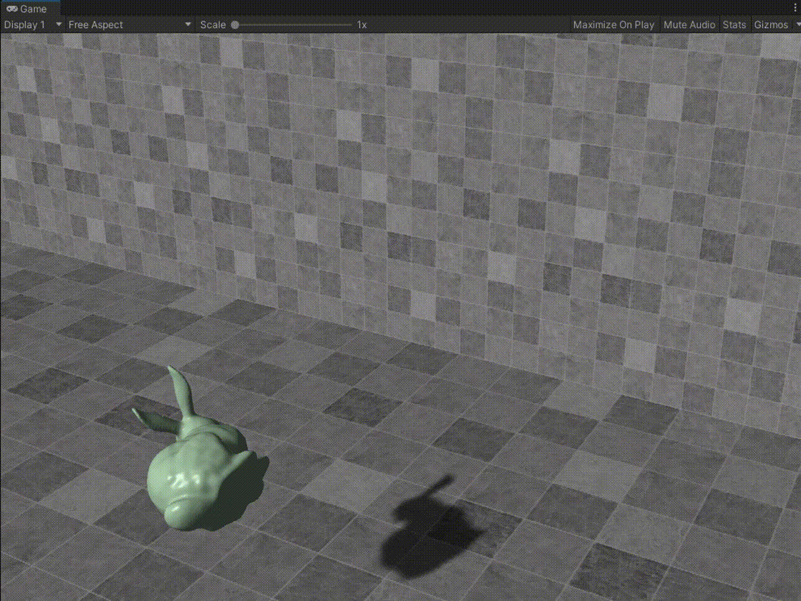</td>
	</tr>
	<tr>
		<td align='center'>Penalty 算法</td>
	</tr>
	<tr>
		<td align='center'>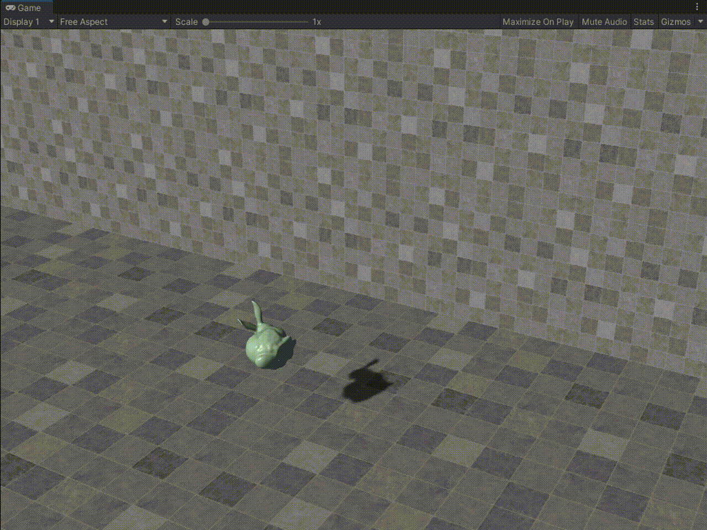</td>
	</tr>
</table>

## 2. Bonus Tasks
1. 实现 Shape Matching 算法
<table border="0">
    <tr>
		<td align='center'>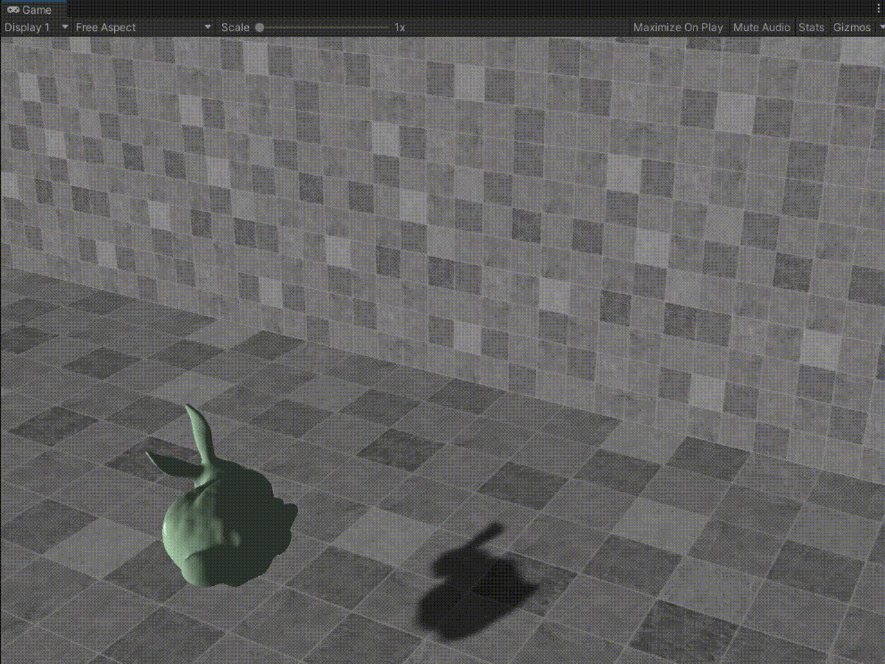</td>
	</tr>
</table>

# GAMES103 Lab2
## 完成内容
1. 完成 Implicit Cloth Solver (with Chebyshev)算法
2. 完成 Position-Based Dynamics (PBD) 算法
## 额外完成
3. 完成 Newton-Raphson 算法 newton_model.cs
4. 完成 Jacobi 算法 (with Chebyshev) jacobi_model.cs
5. 完成 Conjugate Gradient 算法 conjugate_gradient_model.cs
6. 完成 Projective Dynamics 算法 projective_dynamics_model.cs

## 使用控件
用于解线性方程

添加 NuGetForUnity https://github.com/GlitchEnzo/NuGetForUnity

添加 MathNet.Numberics.4.15.0

## 函数调整
### 添加 mesh_helper 文件
1. 碰撞处理 Collision_Handling 移动到此文件
2. ResizeMesh 等函数移动到此文件
    - Quick_Sort
    - Quick_Sort_Partition
    - Swap

### 添加 calc_helper 文件
1. 计算合力 CalcForce
2. 计算 $XX^T$
3. 计算 Hessian 矩阵

## 1. Implicit Cloth Solver
### 测试部分
1. 不初始化 $X_i$ 猜测值，收敛变慢
2. 通过 isChebyshev 变量控制是否使用 Chebyshev 加速
     - 默认的 rho = 0.995f 不稳定， 需要改小到 0.95 左右
3. 使用 Chebyshev 加速后，布料初始下落明显加快了


### 参数设置
1. t = 0.0333
2. spring_k = 8000
3. 迭代求解次数 32

<table border="0">
    <tr>
        <td align='center'>Implicit Cloth Solver 算法</td>
    </tr>
    <tr>
        <td align='center'></td>
    </tr>
    <tr>
        <td align='center'> Chebyshev Acceleration 不稳定状态</td>
    </tr>
    <tr>
        <td align='center'>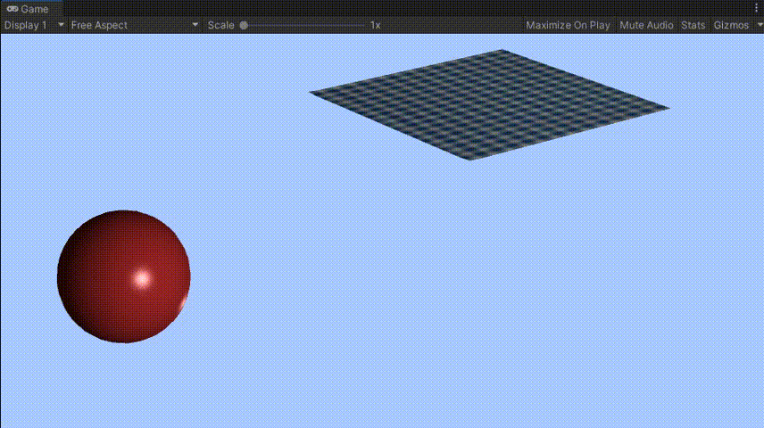</td>
    </tr>
</table>

## 2. PBD
### 参数设置
1. t = 0.0333
2. 迭代求解次数 32
<table border="0">
    <tr>
        <td align='center'></td>
    </tr>
</table>

## 3. Newton-Raphson 算法
### 参数设置
1. 由于 A 的 Inverse 求解速度慢，所以只生成了 5x5 的定点网格
2. t = 0.0333
3. spring_k = 1000
4. 迭代求解次数 5
<table border="0">
    <tr>
        <td align='center'>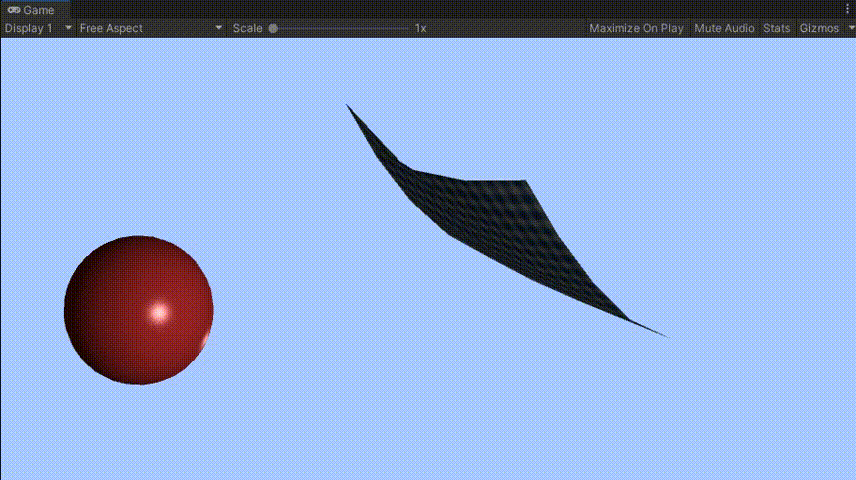</td>
    </tr>
</table>

## 4. Jacobi 算法
### 参数设置
1. t = 0.0222
2. spring_k = 500
3. 定点个数 11x11
4. 迭代求解次数 8
### 使用 Chebyshev 参数设置
1. t = 0.015
2. spring_k = 400
3. 定点个数 11x11
4. 迭代求解次数 8

<table border="0">
    <tr>
        <td align='center'>Implicit Cloth Solver 算法</td>
    </tr>
    <tr>
        <td align='center'>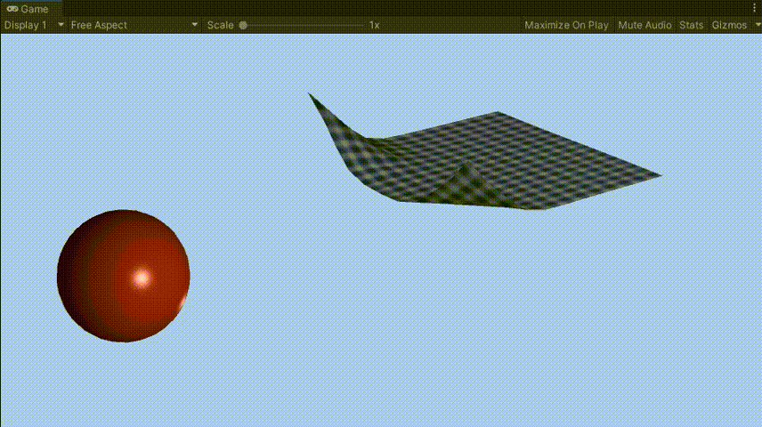</td>
    </tr>
    <tr>
        <td align='center'> Chebyshev Acceleration 不稳定状态所以步长调小了</td>
    </tr>
    <tr>
        <td align='center'>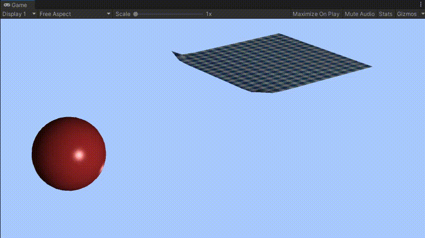</td>
    </tr>
</table>

## 5. Conjugate Gradient 算法
### 参数设置
1. t = 0.0222
2. spring_k = 500
3. 定点个数 11x11
4. 迭代求解次数 10
<table border="0">
    <tr>
        <td align='center'>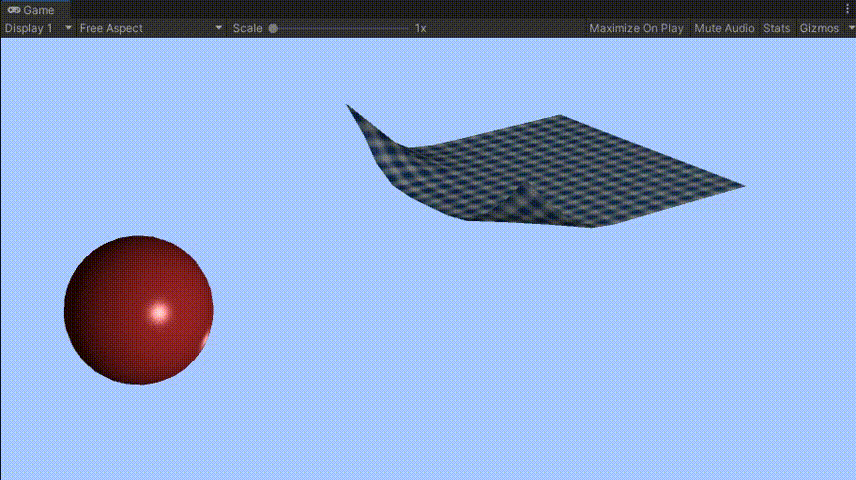</td>
    </tr>
</table>

## 6. Projective Dynamics 算法
由于不是很稳定，所以设置的参数比较小
### 参数设置
1. t = 0.015
2. spring_k = 500
3. 定点个数 5x5
4. 迭代求解次数 5
<table border="0">
    <tr>
        <td align='center'>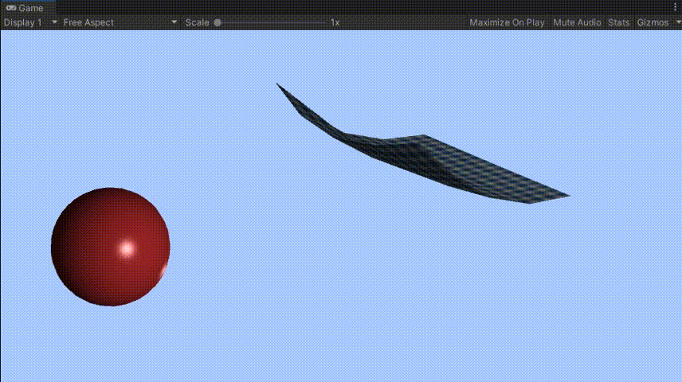</td>
    </tr>
</table>

# GAMES103 Lab3
## 完成内容
1. Basic Tasks
2. Bonus Tasks
## 额外完成内容
1. Neo Hookean 王老师PPT公式
2. Neo Hookean 知乎公式
3. Neo Hookean wiki公式
4. Mooney Rivlin 王老师PPT公式
5. Mooney Rivlin wiki公式
6. Fung 王老师PPT公式

## 使用控件
NuGetForUnity https://github.com/GlitchEnzo/NuGetForUnity

添加 Accord.Math 3.8.0

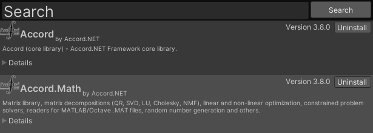


## 文件说明
- FVM.cs 主体问题件
- Hyperelastic.cs 超弹性函数

FVM 中可选择弹性类型和开启平滑

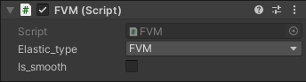

# Cauchy-Green
$$
\begin{aligned}
I_c&=tr(C) = \lambda_0^2 + \lambda_1^2 +\lambda_2^2\\
II_c&=tr(C^2) =\lambda_0^4 + \lambda_1^4 +\lambda_2^4\\
III_c&=det(C)) =\lambda_0^2\lambda_1^2\lambda_2^2\\
\end{aligned}
$$

# 1. FVM 算法
$$
\begin{aligned}
Dm&=[X_{10}\;X_{20}\;X_{30}]\\
F&=[x_{10}\;x_{20}\;x_{30}]D_m^{-1}\\
G&=\frac{1}{2}(F^TF-I)\\
P&=F\frac{\partial{w}}{\partial{G}}\\
[f_{1}\;f_{2}\;f_{3}]&=-\frac{1}{6det(D_m^{-1})}PD_m^{-T}\\
f_0&=-f_1-f_2-f_3
\end{aligned}
$$

<table border="0">
    <tr>
        <td align='center'>FVM</td>
    </tr>
    <tr>
        <td align='center'></td>
    </tr>
    <tr>
        <td align='center'>FVM Smooth</td>
    </tr>
    <tr>
        <td align='center'></td>
    </tr>
</table>

# 2. Hyperelastic Models
$$
\begin{aligned}
Dm&=[X_{10}\;X_{20}\;X_{30}]\\
F&=[x_{10}\;x_{20}\;x_{30}]D_m^{-1}\\
[U\;\Lambda\;V^T]&=svd(F)\\
P&=Udiag(\frac{\partial{w}}{\partial{\lambda_0}},\frac{\partial{w}}{\partial{\lambda_1}},\frac{\partial{w}}{\partial{\lambda_2}})V^T\\
[f_{1}\;f_{2}\;f_{3}]&=-\frac{1}{6det(D_m^{-1})}PD_m^{-T}\\
f_0&=-f_1-f_2-f_3
\end{aligned}
$$

## 1. The Saint Venant-Kirchhoff model (StVK) 王老师PPT的公式
$$
W = \frac{s_0}{2}(I_c-3)^2+\frac{s_1}{4}(II_c-2I_c+3)
$$
### Matrix Calculus
```
S0/2*(L0^2+L1^2+L2^2-3)^2+S1/4*((L0^2*L1^2+L0^2*L2^2+L1^2*L2^2)-2*(L0^2+L1^2+L2^2)+3)
```
$$
\begin{aligned}
\frac{\partial{w}}{\partial{\lambda_0}} &= \frac{\partial f}{\partial \lambda_0} = (4\cdot \lambda_0\cdot s0\cdot (\lambda_0^{2}+\lambda_1^{2}+\lambda_2^{2}-3))/2+(2\cdot \lambda_0\cdot s1\cdot \lambda_1^{2})/4+(2\cdot \lambda_0\cdot s1\cdot \lambda_2^{2})/4-\lambda_0\cdot s1\\
\frac{\partial{w}}{\partial{\lambda_1}} &= \frac{\partial f}{\partial \lambda_1} = (4\cdot \lambda_1\cdot s0\cdot (\lambda_0^{2}+\lambda_1^{2}+\lambda_2^{2}-3))/2+(2\cdot \lambda_1\cdot s1\cdot \lambda_0^{2})/4+(2\cdot \lambda_1\cdot s1\cdot \lambda_2^{2})/4-\lambda_1\cdot s1\\
\frac{\partial{w}}{\partial{\lambda_2}} &= \frac{\partial f}{\partial \lambda_2} = (4\cdot \lambda_2\cdot s0\cdot (\lambda_0^{2}+\lambda_1^{2}+\lambda_2^{2}-3))/2+(2\cdot \lambda_2\cdot s1\cdot \lambda_0^{2})/4+(2\cdot \lambda_2\cdot s1\cdot \lambda_1^{2})/4-\lambda_2\cdot s1
\end{aligned}
$$

<table border="0">
    <tr>
        <td align='center'>Stvk</td>
    </tr>
    <tr>
        <td align='center'></td>
    </tr>
    <tr>
        <td align='center'>Stvk Smooth</td>
    </tr>
    <tr>
        <td align='center'></td>
    </tr>
</table>

## 2. The Neo-Hookean model 王老师PPT公式
$$
W = s_0(III_c^{-1/3}\cdot I-3)+s_1(III_c^{-1/2}-1)
$$
### Matrix Calculus
```
S0*((L0^2*L1^2*L2^2)^(-1/3)*(L0^2+L1^2+L2^2)-3)+S1*((L0^2*L1^2*L2^2)^(-1/2)-1)
```
$$

\begin{aligned}
\frac{\partial f}{\partial \lambda_0} &= 2\cdot \lambda_0\cdot s0\cdot \lambda_2^{-2/3}\cdot \lambda_0^{-2/3}\cdot \lambda_1^{-2/3}-(2\cdot s0\cdot \lambda_0^{-5/3}\cdot \lambda_1^{-2/3}\cdot \lambda_2^{-2/3}\cdot (\lambda_0^{2}+\lambda_1^{2}+\lambda_2^{2}))/3-s1/(\lambda_1\cdot \lambda_2\cdot \lambda_0^{2})\\
\frac{\partial f}{\partial \lambda_1} &= 2\cdot \lambda_1\cdot s0\cdot \lambda_2^{-2/3}\cdot \lambda_0^{-2/3}\cdot \lambda_1^{-2/3}-(2\cdot s0\cdot \lambda_1^{-5/3}\cdot \lambda_0^{-2/3}\cdot \lambda_2^{-2/3}\cdot (\lambda_0^{2}+\lambda_1^{2}+\lambda_2^{2}))/3-s1/(\lambda_0\cdot \lambda_2\cdot \lambda_1^{2})\\
\frac{\partial f}{\partial \lambda_2} &= 2\cdot \lambda_2\cdot s0\cdot \lambda_2^{-2/3}\cdot \lambda_0^{-2/3}\cdot \lambda_1^{-2/3}-(2\cdot s0\cdot \lambda_2^{-5/3)}\cdot \lambda_0^{-2/3}\cdot \lambda_1^{-2/3}\cdot (\lambda_0^{2}+\lambda_1^{2}+\lambda_2^{2}))/3-s1/(\lambda_0\cdot \lambda_1\cdot \lambda_2^{2})
\end{aligned}

$$

## 3. The Neo-Hookean model 知乎公式
```
https://zhuanlan.zhihu.com/p/270606841
```
$$
J = det(F) = \lambda_0 \lambda_1 \lambda_2\\
P = \mu(F-F^{-T})+\lambda log(J)F^{-T}
$$

<table border="0">
    <tr>
        <td align='center'></td>
    </tr>
</table>

## 4. The Neo-Hookean model wiki公式
```
https://en.wikipedia.org/wiki/Neo-Hookean_solid
```
$$
\begin{aligned}
W&=C_1(I_1-3-2lnJ)+D_1(J-1)^2\\
I_1&=\lambda_1^2+\lambda_2^2+\lambda_3^2\\
J&=det(F)=\lambda_1\lambda_2\lambda_3\\
C_1&=\frac{\mu}{2}; D_1=\frac{k}{2}
\end{aligned}
$$

## 5. The Mooney-Rivlin model 王老师PPT公式
$$
W = s_0(III_c^{-1/3}I_c-3)+s_1(III_c^{-1/2}-1)+s_2(\frac{1}{2}III_c^{-2/3}(I_c^2-II_c)-3)
$$

### Matrix Calculus
```
S0*((L0^2*L1^2*L2^2)^(-1/3)*(L0^2+L1^2+L2^2)-3)+S1*((L0^2*L1^2*L2^2)^(-1/2)-1)+S2*((1/2)*(L0^2*L1^2*L2^2)^(-2/3)*((L0^2+L1^2+L2^2)^2-(L0^4+L1^4+L2^4))-3)
```

$$
\begin{aligned}
\frac{\partial W}{\partial \lambda_0} &= 2\cdot \lambda_0\cdot s0\cdot \lambda_2^{-2/3}\cdot \lambda_0^{-2/3}\cdot \lambda_1^{-2/3}-(2\cdot s0\cdot \lambda_0^{-5/3}\cdot \lambda_1^{-2/3}\cdot \lambda_2^{-2/3}\cdot (\lambda_0^{2}+\lambda_1^{2}+\lambda_2^{2}))/3\\
&-s1/(\lambda_1\cdot \lambda_2\cdot \lambda_0^{2})-(4\cdot S2\cdot \lambda_0^{-7/3}\cdot \lambda_1^{-4/3}\cdot \lambda_2^{-4/3}\cdot ((\lambda_0^{2}+\lambda_1^{2}+\lambda_2^{2})^{2}-(\lambda_0^{4}+\lambda_1^{4}+\lambda_2^{4})))/6\\
&+(4\cdot \lambda_0\cdot S2\cdot \lambda_2^{-4/3}\cdot \lambda_0^{-4/3}\cdot \lambda_1^{-4/3}\cdot (\lambda_0^{2}+\lambda_1^{2}+\lambda_2^{2}))/2-(4\cdot S2\cdot \lambda_0^{3}\cdot \lambda_2^{-4/3}\cdot \lambda_0^{-4/3}\cdot \lambda_1^{-4/3})/2\\
\frac{\partial W}{\partial \lambda_1} &= 2\cdot \lambda_1\cdot s0\cdot \lambda_2^{-2/3}\cdot \lambda_0^{-2/3}\cdot \lambda_1^{-2/3}-(2\cdot s0\cdot \lambda_1^{-5/3}\cdot \lambda_0^{-2/3}\cdot \lambda_2^{-2/3}\cdot (\lambda_0^{2}+\lambda_1^{2}+\lambda_2^{2}))/3\\
&-s1/(\lambda_0\cdot \lambda_2\cdot \lambda_1^{2})-(4\cdot S2\cdot \lambda_1^{-7/3}\cdot \lambda_0^{-4/3}\cdot \lambda_2^{-4/3}\cdot ((\lambda_0^{2}+\lambda_1^{2}+\lambda_2^{2})^{2}-(\lambda_0^{4}+\lambda_1^{4}+\lambda_2^{4})))/6\\
&+(4\cdot \lambda_1\cdot S2\cdot \lambda_2^{-4/3}\cdot \lambda_0^{-4/3}\cdot \lambda_1^{-4/3}\cdot (\lambda_0^{2}+\lambda_1^{2}+\lambda_2^{2}))/2-(4\cdot S2\cdot \lambda_1^{3}\cdot \lambda_2^{-4/3}\cdot \lambda_0^{-4/3}\cdot \lambda_1^{-4/3})/2\\
\frac{\partial W}{\partial \lambda_2} &= 2\cdot \lambda_2\cdot s0\cdot \lambda_2^{-2/3}\cdot \lambda_0^{-2/3}\cdot \lambda_1^{-2/3}-(2\cdot s0\cdot \lambda_2^{5/3}\cdot \lambda_0^{-2/3}\cdot \lambda_1^{-2/3}\cdot (\lambda_0^{2}+\lambda_1^{2}+\lambda_2^{2}))/3\\
&-s1/(\lambda_0\cdot \lambda_1\cdot \lambda_2^{2})-(4\cdot S2\cdot \lambda_2^{-7/3}\cdot \lambda_0^{-4/3}\cdot \lambda_1^{-4/3}\cdot ((\lambda_0^{2}+\lambda_1^{2}+\lambda_2^{2})^{2}-(\lambda_0^{4}+\lambda_1^{4}+\lambda_2^{4})))/6\\
&+(4\cdot \lambda_2\cdot S2\cdot \lambda_2^{-4/3}\cdot \lambda_0^{-4/3}\cdot \lambda_1^{-4/3}\cdot (\lambda_0^{2}+\lambda_1^{2}+\lambda_2^{2}))/2-(4\cdot S2\cdot \lambda_2^{3}\cdot \lambda_2^{-4/3}\cdot \lambda_0^{-4/3}\cdot \lambda_1^{-4/3})/2
\end{aligned}
$$

## 6. The Mooney-Rivlin model wiki公式
```
https://en.wikipedia.org/wiki/Mooney–Rivlin_solid
```

### Matrix Calculus
$$
\begin{align}
W&=C_1(J^{-2/3}I_1-3)+\frac{1}{D1}(J-1)^2\\
I_1&=\lambda_1^2+\lambda_2^2+\lambda_3^2\\
I_2&=\lambda_1^2\lambda_2^2+\lambda_2^2\lambda_3^2+\lambda_3^2\lambda_1^2\\
J&=det(F)=\lambda_1\lambda_2\lambda_3\\
C_1&=\frac{\mu}{2}; D_1=\frac{k}{2}
\end{align} 
$$

```
0.5*S0*((L0*L1*L2)^(-2/3)*(L0^2+L1^2+L2^2)-3)+(2/S1)*(L0*L1*L2-1)^2
```

$$
\begin{aligned}
\frac{\partial W}{\partial \lambda_0} &= \lambda_0\cdot s0\cdot \lambda_2^{-2/3}\cdot \lambda_0^{-2/3}\cdot \lambda_1^{-2/3}\\
&-(s0\cdot \lambda_0^{-5/3}\cdot \lambda_1^{-2/3}\cdot \lambda_2^{-2/3}\cdot (\lambda_0^{2}+\lambda_1^{2}+\lambda_2^{2}))/3\\
&+(4\cdot \lambda_1\cdot \lambda_2\cdot (\lambda_0\cdot \lambda_1\cdot \lambda_2-1))/s1\\
\frac{\partial W}{\partial \lambda_1} &= \lambda_1\cdot s0\cdot \lambda_2^{-2/3}\cdot \lambda_0^{-2/3}\cdot \lambda_1^{-2/3}\\
&-(s0\cdot \lambda_1^{-5/3}\cdot \lambda_0^{-2/3}\cdot \lambda_2^{-2/3}\cdot (\lambda_0^{2}+\lambda_1^{2}+\lambda_2^{2}))/3\\
&+(4\cdot \lambda_0\cdot \lambda_2\cdot (\lambda_0\cdot \lambda_1\cdot \lambda_2-1))/s1\\
\frac{\partial W}{\partial \lambda_2} &= \lambda_2\cdot s0\cdot \lambda_2^{-2/3}\cdot \lambda_0^{-2/3}\cdot \lambda_1^{-2/3}\\
&-(s0\cdot \lambda_2^{-5/3}\cdot \lambda_0^{-2/3}\cdot \lambda_1^{-2/3}\cdot (\lambda_0^{2}+\lambda_1^{2}+\lambda_2^{2}))/3\\
&+(4\cdot \lambda_0\cdot \lambda_1\cdot (\lambda_0\cdot \lambda_1\cdot \lambda_2-1))/s1
\end{aligned}
$$

<table border="0">
    <tr>
        <td align='center'>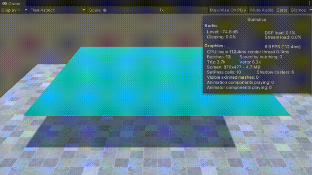</td>
    </tr>
</table>

## 7. The Fung model 王老师PPT公式
$$
W = s_0(III_c^{-1/3}I_c-3)+s_1(III_c^{-1/2}-1)+s_2(e^{s3(III_c^{-1/3}I_c-3)}-1)
$$

### Matrix Calculus
```
S0*((L0^2*L1^2*L2^2)^(-1/3)*(L0^2+L1^2+L2^2)-3)+S1*((L0^2*L1^2*L2^2)^(-1/2)-1)+S2*(exp(s3*(L0^2*L1^2*L2^2)^(-2/3)*(L0^2+L1^2+L2^2)-3)-1)
```

$$
\begin{aligned}
\frac{\partial f}{\partial \lambda_0} &= 2\cdot \lambda_0\cdot s0\cdot \lambda_2^{-2/3}\cdot \lambda_0^{-2/3}\cdot \lambda_1^{-2/3}-(2\cdot s0\cdot \lambda_0^{-5/3}\cdot \lambda_1^{-2/3}\cdot \lambda_2^{-2/3}\cdot (\lambda_0^{2}+\lambda_1^{2}+\lambda_2^{2}))/3-s1/(\lambda_1\cdot \lambda_2\cdot \lambda_0^{2})\\
&-(4\cdot S2\cdot s3\cdot \lambda_0^{-7/3}\cdot \lambda_1^{-4/3}\cdot \lambda_2^{-4/3}\cdot \exp(s3\cdot \lambda_0^{-4/3}\cdot \lambda_1^{-4/3}\cdot \lambda_2^{-4/3}\cdot (\lambda_0^{2}+\lambda_1^{2}+\lambda_2^{2})-3)\cdot (\lambda_0^{2}+\lambda_1^{2}+\lambda_2^{2}))/3\\
&+2\cdot \lambda_0\cdot S2\cdot s3\cdot \lambda_1^{-4/3}\cdot \lambda_2^{-4/3}\cdot \lambda_0^{-4/3}\cdot \exp(s3\cdot \lambda_0^{-4/3}\cdot \lambda_1^{-4/3}\cdot \lambda_2^{-4/3}\cdot (\lambda_0^{2}+\lambda_1^{2}+\lambda_2^{2})-3)\\
\frac{\partial f}{\partial \lambda_1} &= 2\cdot \lambda_1\cdot s0\cdot \lambda_2^{-2/3}\cdot \lambda_0^{-2/3}\cdot \lambda_1^{-2/3}-(2\cdot s0\cdot \lambda_1^{-5/3}\cdot \lambda_0^{-2/3}\cdot \lambda_2^{-2/3}\cdot (\lambda_0^{2}+\lambda_1^{2}+\lambda_2^{2}))/3-s1/(\lambda_0\cdot \lambda_2\cdot \lambda_1^{2})\\
&-(4\cdot S2\cdot s3\cdot \lambda_1^{-7/3}\cdot \lambda_2^{-4/3}\cdot \lambda_0^{-4/3}\cdot \exp(s3\cdot \lambda_0^{-4/3}\cdot \lambda_1^{-4/3}\cdot \lambda_2^{-4/3}\cdot (\lambda_0^{2}+\lambda_1^{2}+\lambda_2^{2})-3)\cdot (\lambda_0^{2}+\lambda_1^{2}+\lambda_2^{2}))/3\\
&+2\cdot \lambda_1\cdot S2\cdot s3\cdot \lambda_1^{-4/3}\cdot \lambda_2^{-4/3}\cdot \lambda_0^{-4/3}\cdot \exp(s3\cdot \lambda_0^{-4/3}\cdot \lambda_1^{-4/3}\cdot \lambda_2^{-4/3}\cdot (\lambda_0^{2}+\lambda_1^{2}+\lambda_2^{2})-3)\\
\frac{\partial f}{\partial \lambda_2} &= 2\cdot \lambda_2\cdot s0\cdot \lambda_2^{-2/3}\cdot \lambda_0^{-2/3}\cdot \lambda_1^{-2/3}-(2\cdot s0\cdot \lambda_2^{-5/3}\cdot \lambda_0^{-2/3}\cdot \lambda_1^{-2/3}\cdot (\lambda_0^{2}+\lambda_1^{2}+\lambda_2^{2}))/3-s1/(\lambda_0\cdot \lambda_1\cdot \lambda_2^{2})\\
&-(4\cdot S2\cdot s3\cdot \lambda_2^{-7/3}\cdot \lambda_1^{-4/3}\cdot \lambda_0^{-4/3}\cdot \exp(s3\cdot \lambda_0^{-4/3}\cdot \lambda_1^{-4/3}\cdot \lambda_2^{-4/3}\cdot (\lambda_0^{2}+\lambda_1^{2}+\lambda_2^{2})-3)\cdot (\lambda_0^{2}+\lambda_1^{2}+\lambda_2^{2}))/3\\
&+2\cdot \lambda_2\cdot S2\cdot s3\cdot \lambda_1^{-4/3}\cdot \lambda_2^{-4/3}\cdot \lambda_0^{-4/3}\cdot \exp(s3\cdot \lambda_0^{-4/3}\cdot \lambda_1^{-4/3}\cdot \lambda_2^{-4/3}\cdot (\lambda_0^{2}+\lambda_1^{2}+\lambda_2^{2})-3)
\end{aligned}
$$

<table border="0">
    <tr>
        <td align='center'></td>
    </tr>
</table>

# GAMES103 Lab4
## 完成内容
1. Basic Tasks
2. Bonus Tasks

## 水面网格
网格划分为斜纹和米字型两种，米字型的网格在表现水波时效果更好

<table border="0">
	<tr>
		<td align='center'>Slash Grid</td>
		<td align='center'>Mi Grid</td>
	</tr>
	<tr>
		<td align='center'>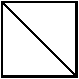</td>
		<td align='center'>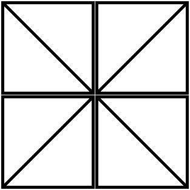</td>
	</tr>
    <tr>
		<td align='center'>Slash Grid</td>
		<td align='center'>Mi Grid</td>
	</tr>
    <tr>
		<td align='center'>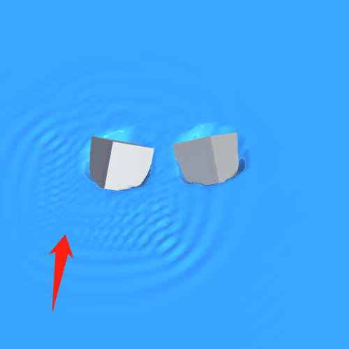</td>
		<td align='center'>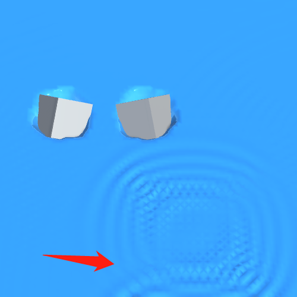</td>
	</tr>
</table>

## 碰撞检测
将平面网格划分成2D的BVH，将Cube与BVH做碰撞求交，然后发出射线测试高度

## 实验效果
<table border="0">
    <tr>
        <td align='center'></td>
    </tr>
</table>