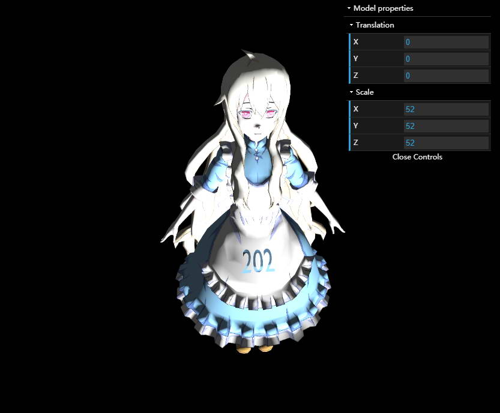
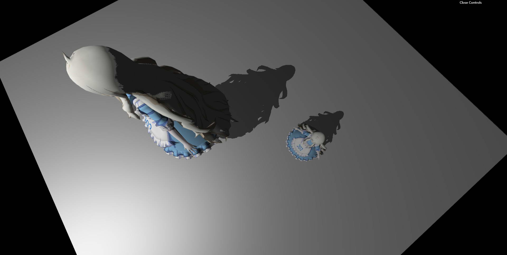
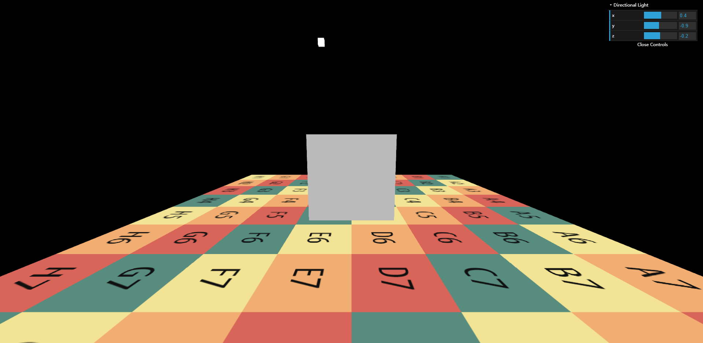

<table>
    <tr>
        <td align='center'></td>
    </tr>

</table>

# GAMES202 Lab0

<table>
    <tr>
        <td align='center'></td>
    </tr>
    <tr>
        <td align='center'></td>
    </tr>
</table>

# GAMES202 Lab1

<table border="0">
    <tr>
        <td align='center'>SM</td>
        <td align='center'>MutilSM</td>
    </tr>
    <tr>
        <td align='center'></td>
        <td align='center'></td>
    </tr>
    <tr>
        <td align='center'>PCF</td>
        <td align='center'>PCSS</td>
    </tr>
    <tr>
        <td align='center'></td>
        <td align='center'></td>
    </tr>
    <tr>
        <td align='center' colspan=2><b>RotSM</b></td>
    </tr>
    <tr>
        <td align='center' colspan=2></td>
    </tr>
</table>

# GAMES202 Lab2

## 完成内容

1. 预计算环境光照
2. 预计算 Diffuse Unshadowed LT
3. Diffuse Shadowed LT
4. 预计算数据使用
5. Bonus 1
6. Bonus 2

## 环境光

<table border="0">
    <tr>
        <td align='center'></td>
        <td align='center'></td>
        <td align='center'></td>
    </tr>
</table>

### PRT

<table border="0">
    <tr>
        <td align='center' colspan=2><b>GraceCathedral</b></td>
    </tr>
    <tr>
        <td align='center'>unshadowed</td>
        <td align='center'>shadowed</td>
    </tr>
    <tr>
        <td align='center'></td>
        <td align='center'></td>
    </tr>
    <tr>
        <td align='center'>interreflection</td>
        <td align='center'>scene</td>
    </tr>
    <tr>
        <td align='center'></td>
        <td align='center'></td>
    </tr>
</table>

<table border="0">
    <tr>
        <td align='center' colspan=2><b>Indoor</b></td>
    </tr>
    <tr>
        <td align='center'>unshadowed</td>
        <td align='center'>shadowed</td>
    </tr>
    <tr>
        <td align='center'></td>
        <td align='center'></td>
    </tr>
    <tr>
        <td align='center'>interreflection</td>
        <td align='center'>scene</td>
    </tr>
    <tr>
        <td align='center'></td>
        <td align='center'></td>
    </tr>
</table>

<table border="0">
    <tr>
        <td align='center' colspan=2><b>SkyBox</b></td>
    </tr>
    <tr>
        <td align='center'>unshadowed</td>
        <td align='center'>shadowed</td>
    </tr>
    <tr>
        <td align='center'></td>
        <td align='center'></td>
    </tr>
    <tr>
        <td align='center'>interreflection</td>
        <td align='center'>scene</td>
    </tr>
    <tr>
        <td align='center'></td>
        <td align='center'></td>
    </tr>
</table>

<table border="0">
    <tr>
        <td align='center'><b>旋转</b></td>
    </tr>
    <tr>
        <td align='center'></td>
    </tr>
</table>

# GAMES202 Lab3

## 完成内容

1. 实现直接光照
2. 实现 Screen Space Ray Tracing
3. 实现间接光照

# 1. 漫反射率

<table border="0">
    <tr>
        <td align='center'>漫反射率</td>
    </tr>
    <tr>
        <td align='center'></td>
    </tr>
    <tr>
        <td align='center'></td>
    </tr>
    <tr>
        <td align='center'></td>
    </tr>
</table>

## 2. 实现 Screen Space Ray Tracing

<table border="0">
    <tr>
        <td align='center'></td>
    </tr>
    <tr>
        <td align='center'></td>
    </tr>
</table>

## 3. 实现间接光照

<table border="0">
    <tr>
        <td align='center'>1 PSS</td>
    </tr>
    <tr>
        <td align='center'></td>
    </tr>
    <tr>
        <td align='center'>60 PSS</td>
    </tr>
    <tr>
        <td align='center'></td>
    </tr>
</table>

# GAMES202 Lab4

## 完成内容

1. 实现预计算E(μ)
2. 实现预计算Eavg
3. 正确实现PBR 材质
4. 正确实现Kulla-Conty 材质
5. Bonus 1：实现重要性采样的预计算方法
6. Bonus 2：在预计算E(μ) 时，使用Split Sum 完成预计算工作

## 1. 预计算E(μ)，2. 预计算Eavg

<table border="0">
    <tr>
        <td align='center'>预计算E(μ)</td>
        <td align='center'>预计算Eavg</td>
    </tr>
    <tr>
        <td align='center'></td>
        <td align='center'></td>
    </tr>
</table>

## 3. 实现 PBR 材质

<table border="0">
    <tr>
        <td align='center'></td>
    </tr>
</table>

## 4. 实现Kulla-Conty 材质

<table border="0">
    <tr>
        <td align='center'></td>
    </tr>
</table>

## 5. Bonus 1：实现重要性采样的预计算方法

<table border="0">
    <tr>
        <td align='center'>预计算E(μ)</td>
        <td align='center'>预计算Eavg</td>
    </tr>
    <tr>
        <td align='center'></td>
        <td align='center'></td>
    </tr>
</table>

## 6. Bonus 2：在预计算E(μ) 时，使用Split Sum 完成预计算工作

<table border="0">
    <tr>
        <td align='center'></td>
    </tr>
</table>

# GAMES202 Lab5

<table border="0">
    <tr>
        <td align='center'></td>
    </tr>
</table>
